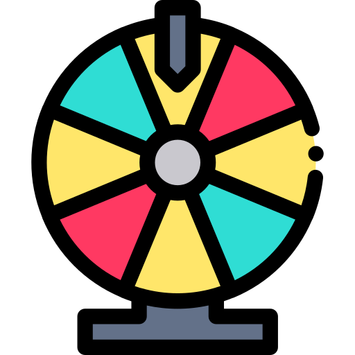

# 🎲 Rohmju's GitHub.io Project 🎲

> **Dein moderner Web-Spielplatz für Casino, Games & mehr – alles live, alles stylish!**

---

## 📚 Inhaltsverzeichnis

- [🎲 Rohmju's GitHub.io Project 🎲](#-rohmjus-githubio-project-)
  - [📚 Inhaltsverzeichnis](#-inhaltsverzeichnis)
  - [📝 Überblick](#-überblick)
  - [🚀 Features](#-features)
  - [🖼️ Screenshots](#️-screenshots)
  - [⚡ Wie funktioniert's?](#-wie-funktionierts)
  - [🛠️ Installation \& Start](#️-installation--start)
  - [🗂️ Projektstruktur](#️-projektstruktur)
  - [To-Do \& Ideen](#to-do--ideen)
  - [Credits](#credits)

---

## 📝 Überblick

**Rohmju's GitHub.io** ist eine interaktive Webplattform mit einer wachsenden Sammlung an modernen Browser-Games und Tools.  
Ob Roulette, Blackjack, Hangman, Slots oder RoyaleAPI – alles läuft direkt im Browser, ohne Installation.  
Das Ziel: **Casino-Feeling, Spielspaß und smarte Tools – alles an einem Ort!**

---

## 🚀 Features

- **🎰 Casino-Suite:**  
  - **Roulette:** Realistisches, animiertes Rad mit perfektem Spin und klassischem Layout  
  - **Blackjack:** Spiele gegen den Dealer, setze Chips, nutze Split & Double Down  
  - **Slots:** Einfacher Slot-Automat mit Gewinn-Animationen  
- **🧩 Hangman:**  
  - Verschiedene Schwierigkeitsgrade, KI-generierte Wörter, Tippsystem  
- **🛡️ RoyaleAPI:**  
  - Clash Royale Spielerinfos live abrufen  
- **✨ Moderne UI:**  
  - Animierte Buttons, responsive Design, Casino-Atmosphäre  
- **🔗 Modular & erweiterbar:**  
  - Neue Spiele und Tools lassen sich einfach hinzufügen

---

## 🖼️ Screenshots

| Lobby | Roulette | Blackjack | Hangman |
|-------|----------|-----------|---------|
|  |  |  |  |

---

## ⚡ Wie funktioniert's?

- **Lobby:**  
  Starte von der Hauptseite und wähle dein Spiel oder Tool per Klick.
- **Casino:**  
  Genieße Roulette, Blackjack oder Slots – alles mit animierten, echten Casino-Elementen.
- **Hangman:**  
  Rate das Wort, fordere die KI heraus, nutze Tipps.
- **RoyaleAPI:**  
  Gib einen Clash Royale Tag ein und erhalte Live-Daten zu Spielern.

---

## 🛠️ Installation & Start

1. **Repository klonen:**  

   ```sh
   git clone https://github.com/rohmju/rohmju.github.io.git
   ```

2. **In Browser öffnen:**  
   Öffne die Datei `index.html` in einem modernen Webbrowser.
3. **Interagieren:**  
   Klicke auf die Buttons, um die verschiedenen Spiele und Tools auszuprobieren.

---

## 🗂️ Projektstruktur

Das Projekt besteht aus folgenden Dateien:

- **index.html**: Die Haupt-HTML-Datei, die als Einstiegspunkt für die Webseite dient.
- **style.css**: Die CSS-Datei, die das Styling für die Webseite definiert.
- **script.js**: Die JavaScript-Datei, die die Logik für die interaktiven Buttons und Animationen enthält.

---

## To-Do & Ideen

- Vervollständige das Minesweeper-Spiel.
- Verbessere die Funktionalität des "Cat"-Buttons.
- Füge weitere interaktive Funktionen und Animationen hinzu.

---

## Credits

- Leonie für schönes CSS und Casino Features
